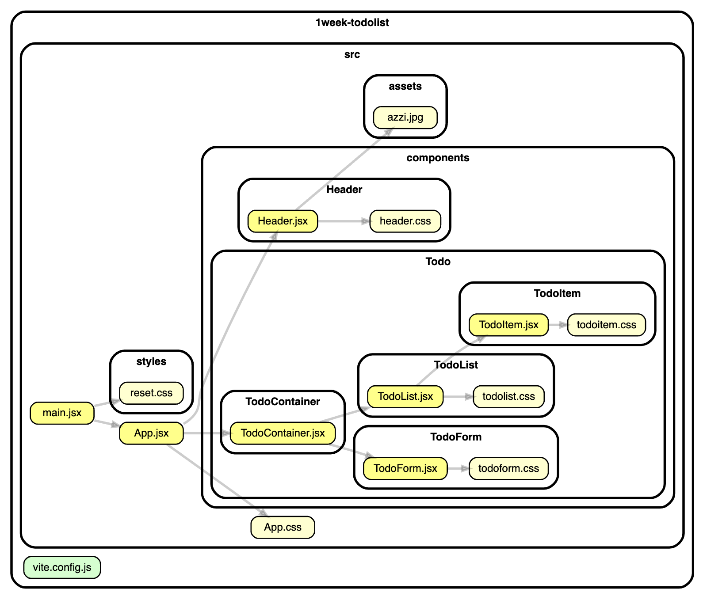

<h1> My Todo List</h1>

> 🔗 프로젝트 링크 : <https://react-assignment-pink-psi.vercel.app/>

## 💡 Goals

> My Todo List 만들기

## ⚙️ features : 구현해야 할 기능

> - UI 구현하기
> - Todo 추가 하기
> - Todo 삭제 하기
> - Todo 완료/취소 상태 변경하기 (진행중 ↔ 완료)

## 폴더구조

```
📦src
 ┣ 📂assets
 ┃ ┣ 📜azzi.jpg
 ┃ ┗ 📜react.svg
 ┣ 📂components
 ┃ ┣ 📂Header
 ┃ ┃ ┣ 📜Header.jsx
 ┃ ┃ ┗ 📜header.css
 ┃ ┗ 📂Todo
 ┃ ┃ ┣ 📂TodoContainer
 ┃ ┃ ┃ ┗ 📜TodoContainer.jsx
 ┃ ┃ ┣ 📂TodoForm
 ┃ ┃ ┃ ┣ 📜TodoForm.jsx
 ┃ ┃ ┃ ┗ 📜todoform.css
 ┃ ┃ ┣ 📂TodoItem
 ┃ ┃ ┃ ┣ 📜TodoItem.jsx
 ┃ ┃ ┃ ┗ 📜todoitem.css
 ┃ ┃ ┗ 📂TodoList
 ┃ ┃ ┃ ┣ 📜TodoList.jsx
 ┃ ┃ ┃ ┗ 📜todolist.css
 ┣ 📂styles
 ┃ ┗ 📜reset.css
 ┣ 📜App.css
 ┣ 📜App.jsx
 ┣ 📜index.css
 ┗ 📜main.jsx
```


